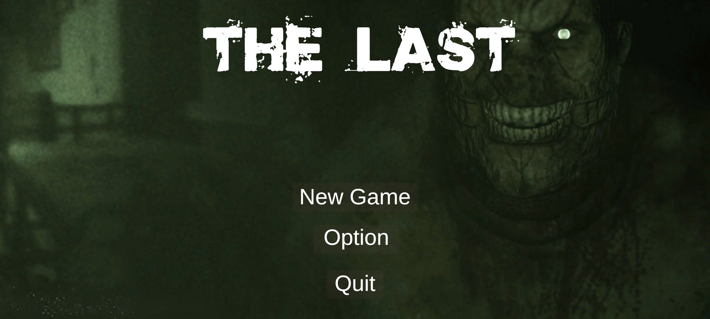
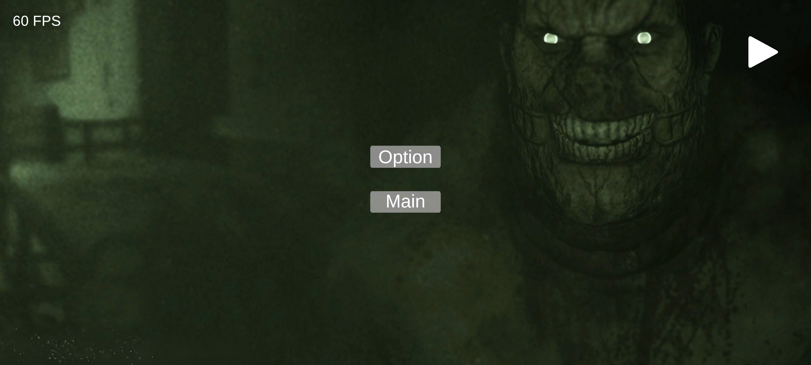
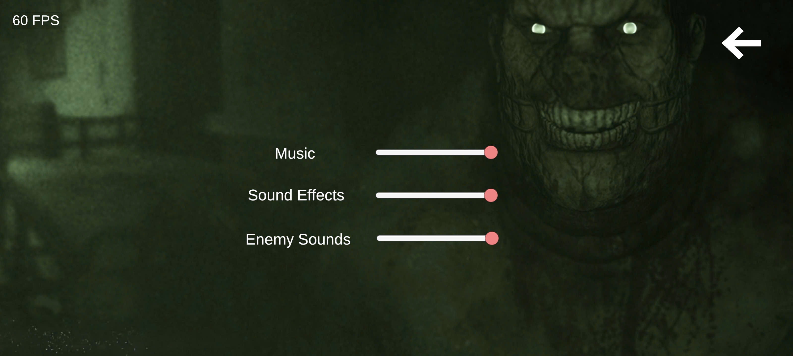
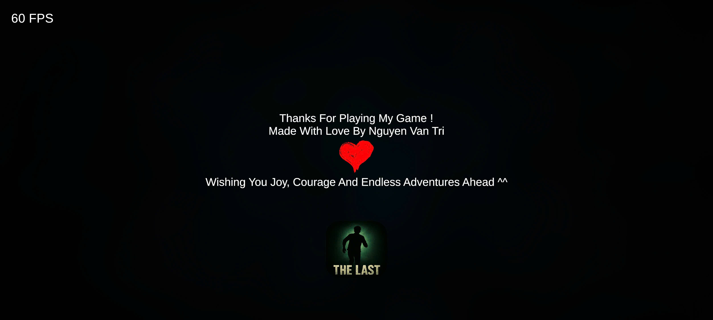
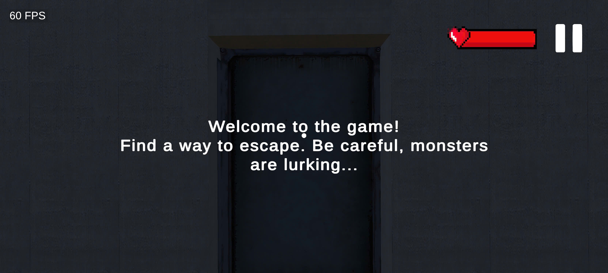
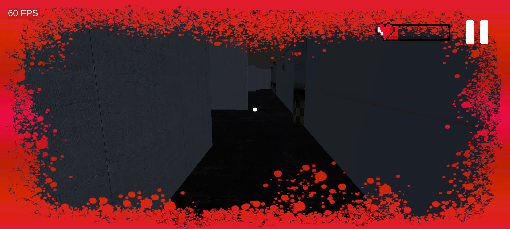
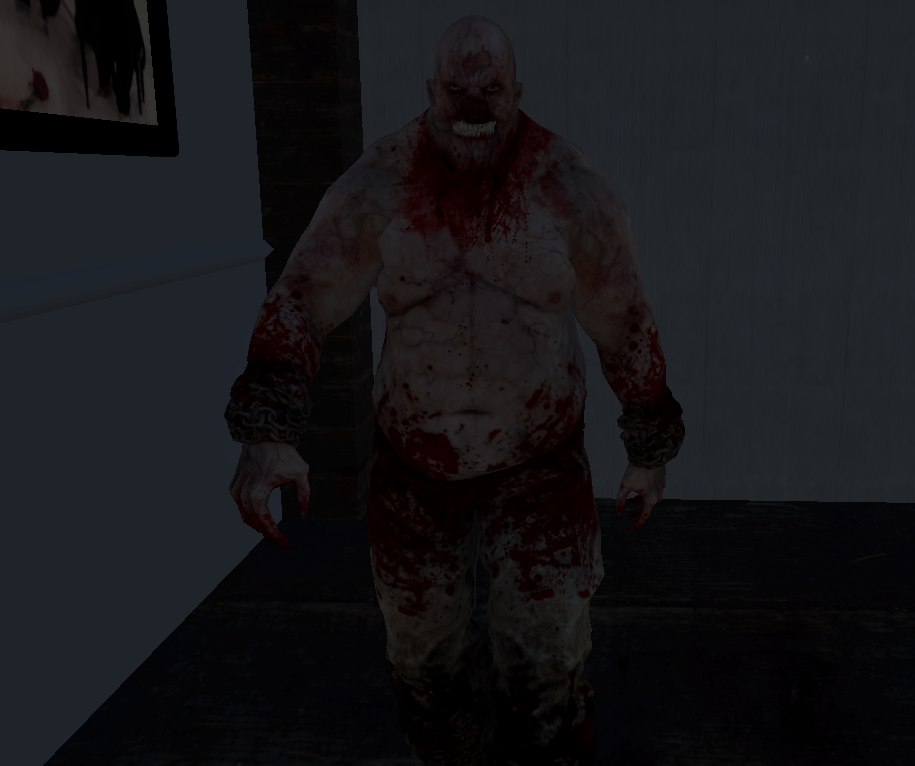
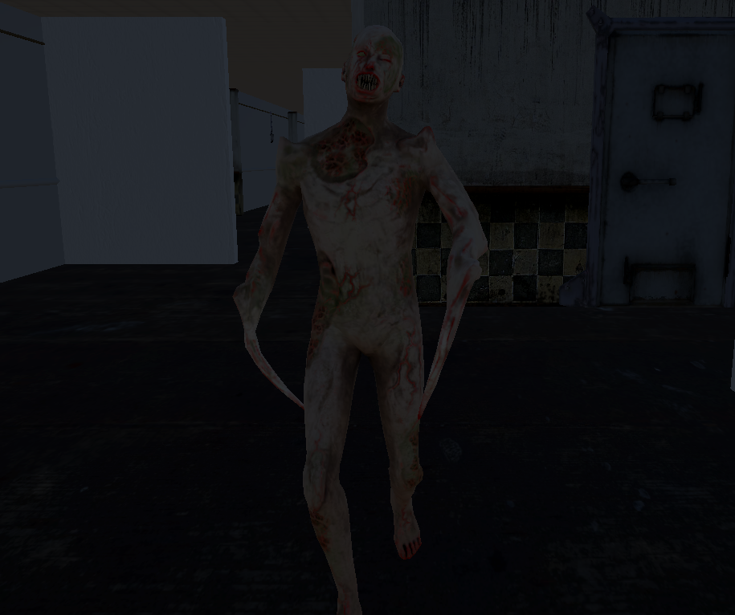
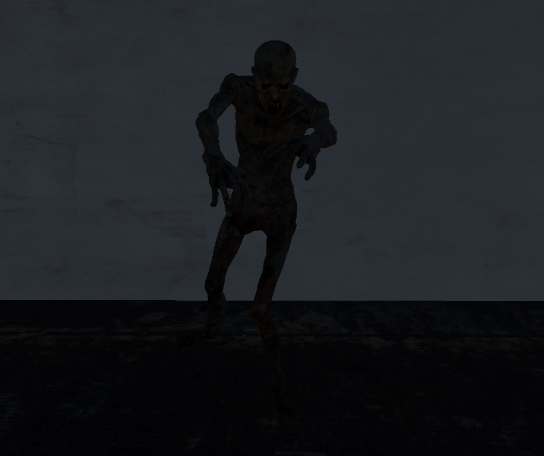

# 🧟 The Last 3D — Outlast-Inspired Horror Game Prototype (Mobile Game)

**The Last 3D** is my first 3D horror game — a short prototype built with **Unity 6**, inspired by the chilling atmosphere of *Outlast*.

It was created as part of my self-learning and exploration in 3D horror game design.

---

🔗 Play Now on Itch.io

 👉 <a href="https://tgadev203.itch.io/thelast3d" target="_blank"><strong>Play TheLast3D on Itch.io</strong></a> 

---

## 🎥 Short Gameplay Preview

  

<h3 align="center">📱 UI Screenshots</h3>

  
  

  
  

  
  

<h3 align="center">👹 Enemies Screenshots</h3>

  
  

  

---

## 🎮 Features

- 👣 First-person controller with immersive movement
- 👀 Enemy avoidance instead of direct combat
- 🧠 Enemy AI: patrols, chases, and attacks the player
- 🩸 Health system: player loses health when hit by enemies
- 🩸 Blood effects for feedback and horror atmosphere
- 🔐 Interactable objects: chests, padlocks, doors
- 💾 Checkpoint-based save/load system
- 🔊 Audio system: voice, ambient, sound effects, music
- 🧭 Minimal UI for interaction prompts and feedback

---

## 🧰 Tech Stack

- **Engine**: Unity 6
- **Language**: C#
- **Rendering**: Universal Render Pipeline (URP)
- **Version Control**: Git & GitHub

---

## 📁 Project Structure Highlights

- `Assets/Scripts/`: All gameplay code (Player, Enemy, Interaction, SoundManager, etc.)
- `Assets/Prefabs/`: Reusable prefabs (enemy, items, etc.)
- `Assets/Scenes/`: Game scenes (prototype levels)
- `Assets/Others/`: UI, audio, effects, and other resources

---

## 🙏 Credits

- **Game Design, Programming, UI, Level Design**: *Nguyen Van Tri*
- **Assets Used**:  
  This project includes free 3D models, sound effects, music, and UI elements from community-based and open-source platforms.  
  These are used **only for educational, non-commercial purposes**.  
  → Full acknowledgments are included in the project folder.

Thanks to the *Outlast*-inspired creators and the game dev community!

---

## 🚧 Limitations & Future Work

This is an early-stage prototype and has many areas for improvement:

- Audio system is still basic due to limited sources
- Enemy AI and level design are under development
- No full combat system or inventory yet
- Needs further polish, optimization, and UX tuning

I'm still learning and working to improve. Any feedback is welcome!

---

## 👤 About Me

I'm a Computer Science student with a passion for game development.  
This project is part of my journey to master Unity and C#.

Even though it's just the beginning, I'm proud of what I've made so far — and I'm excited to grow from here.

---
